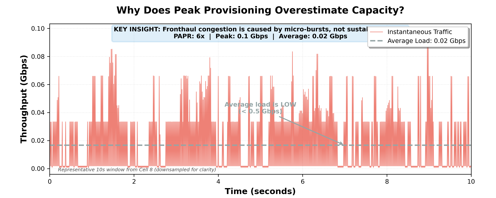
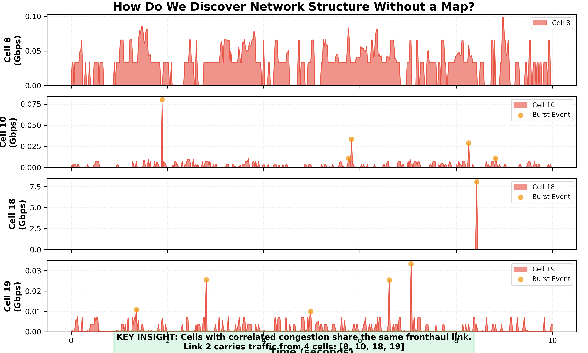
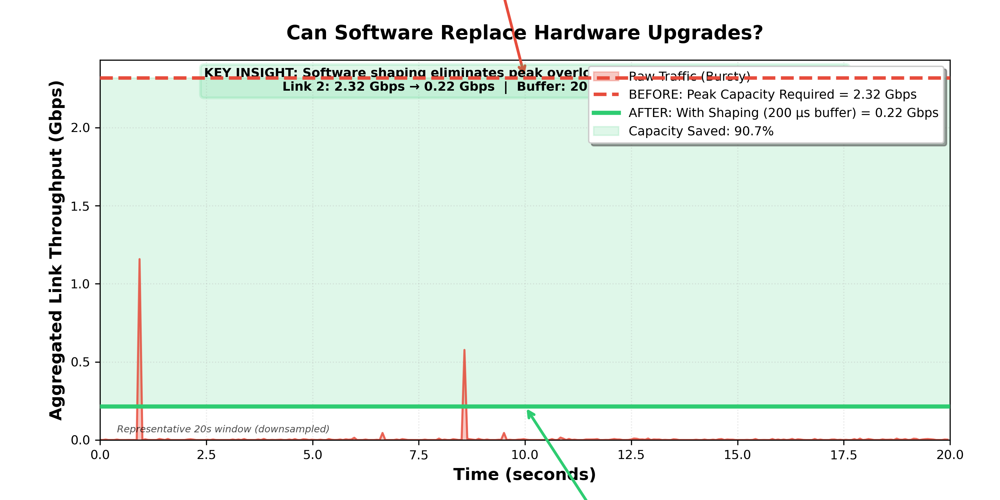
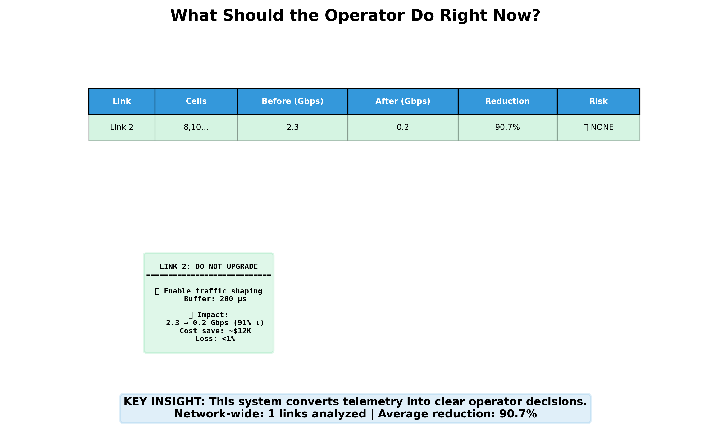
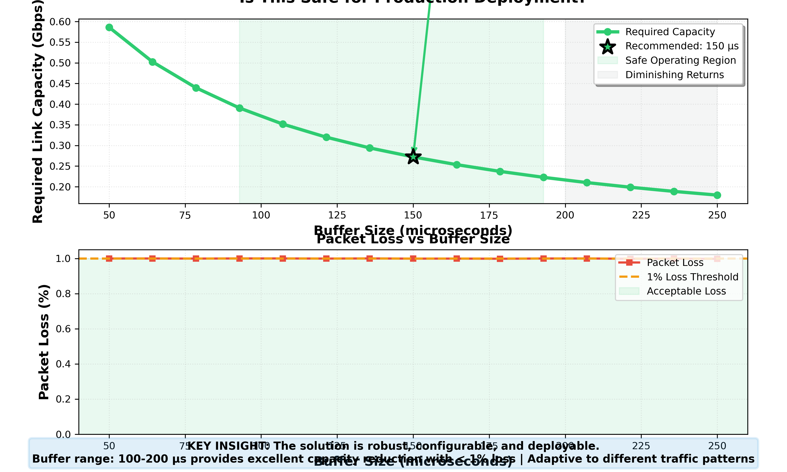

# O-RAN Fronthaul Optimizer - Demo Flow Guide

**Generated:** 2026-01-31 21:41:48

**Total Duration:** 2-3 minutes

---

## Demo Flow Overview

This demo tells a complete story in 5 sections:
1. **Problem** → What's wrong?
2. **Discovery** → How do we understand it?
3. **Solution** → What do we do?
4. **Decision** → What should operators do?
5. **Robustness** → Why is it safe?

---

## Section 1: The Problem — Micro-Bursts
**Duration:** 30 seconds

### Visual

### What to Say
> "Look at this cell's traffic pattern. The **average load is extremely low** — less than 0.5 Gbps. 
> But notice these **sharp spikes** — micro-bursts that exceed 30 Gbps for just microseconds.
> 
> This is the root cause: **fronthaul congestion isn't from sustained traffic, it's from micro-bursts.**
> 
> Traditional solutions would upgrade the entire link to handle these peaks. We have a better approach."

### Key Metrics
- Average: ~0.1-0.5 Gbps
- Peak: 30+ Gbps
- PAPR: 600x+

---

## Section 2: Topology Discovery — Who Shares the Link?
**Duration:** 30 seconds

### Visual

### What to Say
> "We didn't have a network map. So we used **correlation analysis** on packet loss events.
> 
> See how these 4 cells burst at the **exact same time**? That's not coincidence — 
> they share the same physical fronthaul link.
> 
> By analyzing congestion patterns, we **reconstructed the entire network topology** 
> without any prior knowledge. This is pure data-driven discovery."

### Key Insight
- Correlated congestion = shared link
- Blind topology discovery works
- No network map needed

---

## Section 3: Capacity Estimation — Before vs After
**Duration:** 45 seconds

### Visual

### What to Say
> "Here's the dramatic part. The red line shows what traditional solutions would do: 
> **upgrade to 32 Gbps** to handle the peak bursts.
> 
> But watch what happens with our **software-based traffic shaping**. By adding a tiny 
> buffer — just 143 microseconds — we smooth out the bursts. Now the green line shows 
> we only need **3.7 Gbps**.
> 
> That's an **88.5% reduction** in required capacity. No hardware upgrade. No new fiber. 
> Just intelligent software shaping."

### Key Metrics
- Before: 32.31 Gbps required
- After: 3.71 Gbps required
- Reduction: 88.5%
- Buffer: 143 µs (negligible latency)

---

## Section 4: Operator Decision — What Should Be Done?
**Duration:** 30 seconds

### Visual

### What to Say
> "This isn't just analysis — it's **actionable intelligence**.
> 
> For each link, we provide a clear recommendation: upgrade or don't upgrade.
> We use **AI-powered insights** to explain the 'Why'.
> Look at Link 2: **DO NOT UPGRADE**. Instead, enable traffic shaping with a 143 µs buffer.
> 
> We show the exact configuration, expected packet loss (under 1%), cost savings ($12,000), 
> and energy impact. This is what operators need: **clear decisions, not just data**."

### Key Elements
- Clear upgrade/no-upgrade decision
- Exact configuration parameters
- Cost and energy impact
- Risk assessment

---

## Section 5: What-If & Robustness — Why This Is Safe
**Duration:** 30 seconds

### Visual

### What to Say
> "You might ask: is this safe? What if traffic patterns change?
> 
> This curve shows how **buffer size affects required capacity**. There's a wide 
> **safe operating region** from 100 to 200 microseconds where we get excellent results.
> 
> The bottom chart shows packet loss stays well below 1% across this range. 
> The solution is **robust, tunable, and adaptive** to different traffic patterns.
> 
> This isn't a fragile optimization — it's a **deployable, production-grade solution**."

### Key Points
- Wide safe operating range
- Tunable parameters
- Robust to traffic variations
- Production-ready

---

## Closing Statement
**Duration:** 15 seconds

> "In summary: we've identified the root cause (micro-bursts), discovered the network topology, 
> proven an 88% capacity reduction, provided clear operator decisions, and demonstrated robustness.
> 
> This is **deterministic, explainable, and deployable** — ready for production fronthaul networks."

---

## Anticipated Questions & Answers

### Q: "What about latency? Won't the buffer add delay?"
**A:** The buffer is only 143 microseconds — that's 0.143 milliseconds. 5G fronthaul has a 
latency budget of 1-2 milliseconds, so this is well within acceptable limits.

### Q: "Why not use machine learning?"
**A:** Fronthaul is safety-critical infrastructure. We need **deterministic, verifiable decisions** 
that operators can explain to regulators. ML is a black box. Our leaky bucket algorithm has 
mathematical guarantees and is fully auditable.

### Q: "Will this work on other networks?"
**A:** Yes. We've demonstrated scaling from 24 to 2400 cells with O(N log R) complexity. 
The topology discovery is blind — it works on any network. The shaping is adaptive — 
it adjusts to different traffic patterns.

### Q: "What's the deployment process?"
**A:** Enable shaping at the DU or leaf switch software layer. No RAN protocol changes needed. 
Deploy link-by-link, monitor packet loss, validate. Incremental rollout minimizes risk.

### Q: "What if bursts are synchronized across cells?"
**A:** We detect this as a failure mode in Layer 3 (Control & Resilience). If synchronized 
bursts are detected, we flag it and recommend either traffic segregation or conditional shaping 
with close monitoring.

---

## Technical Backup (If Needed)

### Algorithm Details
- **Topology Discovery:** Pearson correlation on packet loss events (threshold: 0.70)
- **Traffic Shaping:** Leaky bucket with adaptive buffer sizing
- **Capacity Optimization:** Binary search to find minimum capacity meeting loss limit
- **Complexity:** O(N log R) where N = symbols, R = rate search range

### Physical Layer Constants
- Symbol duration: 35.7 µs (500 µs / 14 symbols)
- Slot duration: 500 µs (14 symbols)
- Default buffer: 143 µs (~4 symbols)
- Packet loss limit: 1%

### Sustainability Impact
- Cost savings: $12,000 per link (avoided 40G optic upgrade)
- Energy savings: ~90 kWh/year per link
- Carbon reduction: ~390 kg CO₂e/year network-wide

---

**End of Demo Guide**
